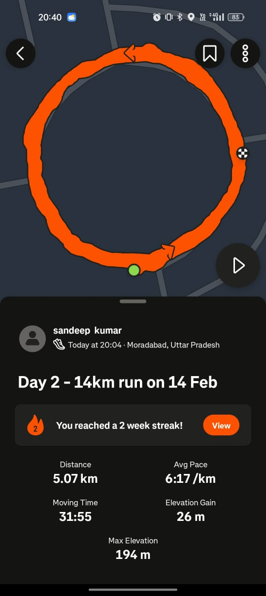

# 02-02-2026

## Focus

Endurance run + LMS project execution.

## Work Done

- Outdoor run
- Resumed LMS development (private repository)
- Executed daily task checklist

## Output

- Run distance: 5 km (nonstop)
- Time: 32 minutes
- Pace: ~6:24 min/km
- Daily tasks completed: 14 / 15
- Water intake: 3 L (target missed)

## Time Spent

- Running: 32 minutes
- LMS + tasks: not tracked

## Notes

Distance increased from previous baseline. One daily task skipped. Hydration target not met.

## Proof

[Instagram video](https://www.instagram.com/reel/DUQyHmmkkVk/)

